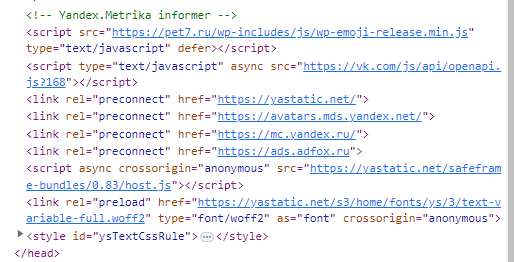

# Урок 1. Веб-технологии: вчера, сегодня, завтра

## Задача: на основе сайта https://pet7.ru/ :

1. Определите, на каком *протоколе* работает сайт.

2. Проанализируйте структуру страницы сайта. Покажите в коде *header footer и content*

3. Внесите не менее *3 изменений на страницу* с помощью инструмента разработчика и *представьте скриншоты было/стало*.

4. Создайте прототип низкой детализации.

Сдайте в виде zip-архива со *скриншотами результатов*, назовите файл по смыслу работы. ИЛИ можете использовать сервис https://www.notion.so/ или *в идеале гит*.

## Задание 1:

Определите, на каком *протоколе* работает сайт

Данную задачу можно выполнить будучи не посещая ссайт, так как протокол на котором работает ссайт находится в URI ссайта **_https_**://pet7.ru/.
Из этого следует что данный ссайт работает на протоколе **_https_**, что значит он использует шифрование для защиты данных

## Задание 2:

Проанализируйте структуру страницы сайта. Покажите в коде *header footer и content*

* Header данной страницы в коде выглядит так:

 

* Footer данной страницы в коде выглядит так:

* Content данной страницы в ккоде выглядит так:

## Задание 3:

Внесите не менее *3 изменений на страницу* с помощью инструмента разработчика и *представьте скриншоты было/стало*.

* Было:

 

* Стало:

